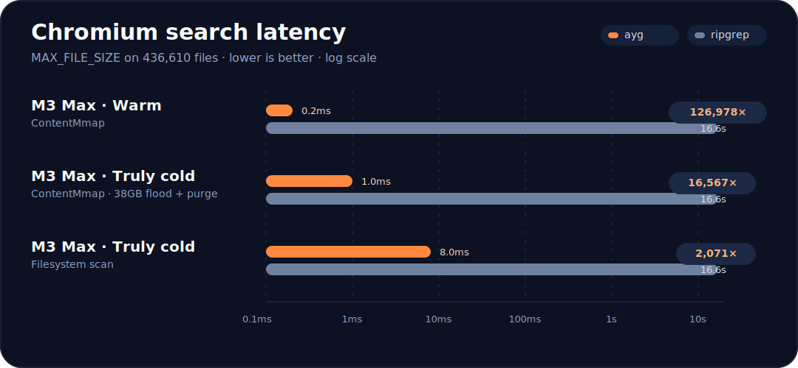

<div align="center">
  <h1>ayg</h1>
  <p><strong>Indexed code search for AI agents and humans</strong></p>
  <p>
    <a href="https://github.com/hemeda3/aygrep/actions"></a>
    <a href="https://github.com/hemeda3/aygrep/releases"></a>
    <a href="https://crates.io/crates/aygrep"></a>
    <a href="LICENSE"></a>
  </p>
</div>

---


<p align="center">
  
</p>

##### On an 8GB cloud VM where ripgrep takes 3.5 minutes per query, ayg returns in 160ms.
| **Device** | **State** | **Mode** | **ayg** | **ripgrep** | **Speedup** |
|------------|-----------|----------|--------:|------------:|------------:|
| **M3 Max MacBook Pro** | **Warm** | ContentMmap | **0.2ms** | 16,567ms | **126,978×** |
| **M3 Max MacBook Pro** | **Truly cold** | ContentMmap | **1.0ms** | 16,567ms | **16,567×** |
| **M3 Max MacBook Pro** | **Truly cold** | Filesystem | **8.0ms** | 16,567ms | **2,071×** |

**Up to 126,978× faster on Chromium.** Tested on the two largest open-source codebases: Chromium (436K files) and the Linux kernel (79K files). Every result verified correct against ripgrep.

ayg builds a sparse n-gram inverted index. One build, instant search. 24 candidates out of 436,610 files — 99.995% of I/O eliminated before a single byte is scanned.

**Built for AI coding agents** that search 50+ times per session. On an 8GB cloud VM where ripgrep takes 3.5 minutes per query, ayg returns in 160ms. The index pays for itself after 7 queries.

Based on reverse-engineering [Cursor's "Fast regex search"](https://cursor.com/blog/fast-regex-search) blog post (March 2026, Vicent Marti).

---

## Install

### From binary (recommended)

```bash
curl -fsSL https://raw.githubusercontent.com/hemeda2/aygrep/main/scripts/install.sh | bash
```

### From source

```bash
cargo install aygrep
```

### Homebrew (macOS/Linux)

```bash
brew install hemeda3/tap/ayg
```

## Quick start

`ayg build` creates `ayg_index/` inside the target repo. Run `ayg search` and `ayg benchmark` from that same repo directory.

```bash
# Build the index once (one-time, ~90s on M3 Max)
ayg build ~/code/chromium

# Search from inside the indexed repo
cd ~/code/chromium
ayg search "MAX_FILE_SIZE"

# Output modes
ayg search "std::unique_ptr" -c   # show total match count
ayg search "WebContents" -l       # list matching file paths
ayg search "TODO" --json          # JSON output for scripts

# Run the built-in benchmark suite
ayg benchmark
```

On machines with less than 8GB of available RAM, `ayg build` automatically skips `content.bin` and uses filesystem scan mode.

---

## Benchmarks

### Test machines

| Machine | CPU | Cores | RAM | Storage |
|---------|-----|-------|-----|---------|
| **M3 Max MacBook Pro 16"** | Apple M3 Max @ 4.05 GHz | 14 (10P+4E) | 36 GB unified | Apple SSD AP1024Z (~7 GB/s seq, ~2μs random) |
| **GCP e2-standard-8** | AMD EPYC 7B12 @ 2.25 GHz | 8 vCPU (4C/8T) | 32 GB | pd-ssd network-attached (~400 MB/s seq, ~1-5ms random) |
| **GCP e2-standard-2** | AMD EPYC 7B12 @ 2.25 GHz | 2 vCPU (1C/2T) | 8 GB | pd-ssd network-attached |

### Corpora

| Corpus | Files indexed | Source size | Index (with content) | Index (no content) |
|--------|--------------|-------------|---------------------|-------------------|
| **Chromium** | 436,610 | ~6.7 GB | 3,123 MB | 831 MB |
| **Linux kernel** | 79,225 | ~1.2 GB | — | 364 MB |

---

### Chromium — M3 Max, truly cold (38GB memory flood + purge)

The most honest benchmark: every byte faulted from SSD, nothing in page cache. Each run preceded by `dd if=/dev/zero of=/tmp/mf bs=1m count=38000 && rm /tmp/mf && purge`.

**No content file (filesystem scan mode):**

| Query | ayg cold | ripgrep | Speedup | Candidates |
|-------|----------|---------|---------|------------|
| `MAX_FILE_SIZE` | **8.0ms** | 16,567ms | **2,071×** | 24 |
| `kMaxBufferSize` | **60ms** | 17,041ms | **284×** | 140 |
| `gpu::Mailbox` | **412ms** | 16,797ms | **41×** | 419 |
| `NOTREACHED` | **1,648ms** | 18,440ms | **11×** | 8,310 |
| `std::unique_ptr` | **4,223ms** | 11,684ms | **2.8×** | 43,371 |

**With content file (content mmap build):**

| Query | ayg cold | ripgrep | Speedup |
|-------|----------|---------|---------|
| `MAX_FILE_SIZE` | **1.0ms** | 16,567ms | **16,567×** |
| `NOTREACHED` | **36.2ms** | 18,440ms | **509×** |
| `#include "base/` | **109.4ms** | ~16,500ms | **~151×** |

### Chromium — M3 Max, warm cache

**With content file (ContentMmap mode):**

| Query | ayg | ripgrep (fresh, median of 3) | ripgrep (3 runs) | Speedup | Candidates |
|-------|-----|------------------------------|-------------------|---------|------------|
| `MAX_FILE_SIZE` | **0.2ms** | 16,567ms | 16,011 / 18,159 / 16,567 | **126,978×** | 24 |
| `kMaxBufferSize` | **0.4ms** | 17,041ms | 17,750 / 17,041 / 11,306 | **26,577×** | 140 |
| `gpu::Mailbox` | **0.4ms** | 16,797ms | 16,797 / 16,497 / 17,404 | **30,276×** | 419 |
| `NOTREACHED` | **8.7ms** | 18,440ms | 17,152 / 18,440 / 18,902 | **1,241×** | 8,310 |
| `base::Unretained` | **7.7ms** | 18,576ms | 18,114 / 18,576 / 18,989 | **1,577×** | 7,894 |
| `constexpr char k` | **9.7ms** | 15,063ms | 18,896 / 14,241 / 15,063 | **1,084×** | 8,332 |
| `WebContents` | **9.5ms** | 10,877ms | 11,739 / 10,605 / 10,877 | **1,317×** | 11,695 |
| `std::unique_ptr` | **22.2ms** | 11,684ms | 11,439 / 11,684 / 12,189 | **505×** | 43,371 |
| `#include "base/` | **35.9ms** | ~16,500ms | — | **362×** | 78,979 |

All ripgrep baselines freshly measured same session, same machine state, same thermal conditions.

**Without content file (Filesystem mode):**

| Query | ayg | ripgrep (fresh median) | Speedup | Candidates |
|-------|-----|----------------------|---------|------------|
| `MAX_FILE_SIZE` | **1.2ms** | 16,567ms | **13,806×** | 24 |
| `kMaxBufferSize` | **8.2ms** | 17,041ms | **2,078×** | 140 |
| `gpu::Mailbox` | **26.8ms** | 16,797ms | **627×** | 419 |
| `NOTREACHED` | **2,150ms** | 18,440ms | **8.6×** | 8,310 |
| `base::Unretained` | **1,934ms** | 18,576ms | **9.6×** | 7,894 |
| `constexpr char k` | **1,933ms** | 15,063ms | **7.8×** | 8,332 |
| `WebContents` | **2,330ms** | 10,877ms | **4.7×** | 11,695 |
| `std::unique_ptr` | **16,785ms** | 11,684ms | **0.7×** | 43,371 |

> **Note:** Without content.bin, broad queries matching 43K+ files are slower than ripgrep on warm cache — 43K individual file open/read/close syscalls are slower than ripgrep's optimized SIMD parallel scan. With content file, the same query takes 22.2ms (505× faster). Selective queries (<500 candidates) always win regardless of mode.

---

### Chromium — GCP e2-standard-8 (32GB, pd-ssd), cold (drop_caches)

Content mmap mode. `echo 3 | sudo tee /proc/sys/vm/drop_caches` before each query. ripgrep cold measured on same VM.

| Query | ayg mmap | ayg pread | ripgrep cold | Speedup (mmap) |
|-------|---------|-----------|--------------|----------------|
| `MAX_FILE_SIZE` | **0.6ms** | 3.3ms | 80,311ms | **133,852×** |
| `kMaxBufferSize` | **1.0ms** | 3.4ms | 81,315ms | **81,315×** |
| `gpu::Mailbox` | **0.4ms** | 2.7ms | 78,929ms | **197,323×** |
| `NOTREACHED` | **24.9ms** | 64.8ms | 80,005ms | **3,213×** |
| `base::Unretained` | **32.8ms** | 91.6ms | 78,357ms | **2,389×** |
| `constexpr char k` | **29.4ms** | 59.7ms | 78,397ms | **2,666×** |
| `WebContents` | **25.5ms** | 61.6ms | 79,855ms | **3,131×** |
| `std::unique_ptr` | **63.0ms** | 181.8ms | 79,819ms | **1,267×** |
| `#include "base/` | **86.4ms** | 270.9ms | 79,712ms | **922×** |

### Chromium — GCP e2-standard-8 (32GB, pd-ssd), warm

| Query | ayg mmap | ayg pread | ripgrep warm | Speedup (mmap) |
|-------|---------|-----------|--------------|----------------|
| `MAX_FILE_SIZE` | **0.4ms** | 2.9ms | 1,693ms | **4,233×** |
| `kMaxBufferSize` | **1.0ms** | 2.4ms | 1,647ms | **1,647×** |
| `gpu::Mailbox` | **0.4ms** | 1.3ms | 1,695ms | **4,238×** |
| `NOTREACHED` | **34.8ms** | 49.1ms | 1,683ms | **48×** |
| `base::Unretained` | **30.0ms** | 46.3ms | 1,693ms | **56×** |
| `constexpr char k` | **26.4ms** | 42.5ms | 1,675ms | **63×** |
| `WebContents` | **31.4ms** | 51.7ms | 2,611ms | **83×** |
| `std::unique_ptr` | **88.7ms** | 147.7ms | 2,191ms | **25×** |
| `#include "base/` | **121.9ms** | 227.2ms | 1,867ms | **15×** |

---

### Chromium — GCP e2-standard-2 (8GB, 2 vCPU, pd-ssd) — worst case

Filesystem scan mode. No content file. `echo 3 | sudo tee /proc/sys/vm/drop_caches` before each query.

Worst case: slowest CPU, smallest RAM, network-attached disk, no content file, cold cache.

| Query | ayg cold | ripgrep cold | Speedup | Candidates |
|-------|----------|-------------|---------|------------|
| `MAX_FILE_SIZE` | **160ms** | 209,000ms (3.5 min) | **1,308×** | 24 |
| `kMaxBufferSize` | **552ms** | ~209,000ms | **~379×** | 140 |
| `gpu::Mailbox` | **667ms** | ~209,000ms | **~313×** | 419 |
| `NOTREACHED` | **10,487ms** | 223,000ms (3.7 min) | **21×** | 8,313 |
| `base::Unretained` | **10,315ms** | ~223,000ms | **~22×** | 7,894 |
| `std::unique_ptr` | **39,332ms** | 264,000ms (4.4 min) | **6.7×** | 43,376 |
| `#include "base/` | **65,616ms** | ~264,000ms (4.4 min) | **~4×** | 78,985 |

ayg wins every query even on worst-case hardware.

### GCP-8 — page cache thrashing (8GB RAM vs 6.7GB corpus)

On memory-constrained machines, brute-force tools thrash the page cache. ayg is the only tool that **gets faster** across repeated runs.

**NOTREACHED — all tools, cold → warm pass 1 → warm pass 2:**

| Tool | Cold | Warm 1 | Warm 2 | Trend |
|------|------|--------|--------|-------|
| ripgrep | 247,634ms | 7,192ms | **54,065ms** | Gets slower |
| grep | — | 64,940ms | **80,906ms** | Gets slower |
| ag | — | 77,833ms | **88,544ms** | Gets slower |
| ugrep | — | 26,023ms | **57,683ms** | Gets slower |
| git grep | — | 55,867ms | **45,456ms** | ~same |
| **ayg** | — | 9,663ms | **330ms** | **29× faster** |

**WebContents — all tools:**

| Tool | Cold | Warm 1 | Warm 2 | Trend |
|------|------|--------|--------|-------|
| ripgrep | 206,336ms | 7,119ms | **29,216ms** | Gets slower |
| grep | — | 17,469ms | **110,057ms** | Gets slower |
| ag | — | 82,757ms | **72,994ms** | ~same |
| ugrep | — | 40,668ms | **74,723ms** | Gets slower |
| git grep | — | 36,379ms | **38,478ms** | ~same |
| **ayg** | — | 4,363ms | **346ms** | **12.6× faster** |

**base::Unretained — all tools, cold + warm 1:**

| Tool | Cold | Warm 1 |
|------|------|--------|
| ripgrep | 224,192ms (3.7 min) | 55,324ms |
| grep | — | 287,653ms (4.8 min) |
| ag | — | 349,425ms (5.8 min) |
| ugrep | — | 198,569ms (3.3 min) |
| git grep | — | 134,725ms (2.2 min) |
| **ayg** | — | **6,765ms** |

**Why:** ayg reads 8K-12K candidate files (~50-100MB working set). Fits in 8GB. Every brute-force tool reads all 436K files (6.7GB). Doesn't fit. Each scan evicts the previous scan's cached pages. ayg's advantage grows under memory pressure.

---

## Linux Kernel (79,225 files)

### M3 Max — truly cold (38GB flood + purge, content mmap)

ripgrep's own official benchmark corpus and patterns.

| Query | ayg | ripgrep | Speedup | Files matched |
|-------|-----|---------|---------|---------------|
| `PM_RESUME` | **6.2ms** | 3,585ms | **578×** | 13 |
| `EXPORT_SYMBOL_GPL` | **15.8ms** | 3,549ms | **225×** | 3,129 |
| `Copyright` | **74.3ms** | 3,783ms | **51×** | 49,482 |

All match counts verified identical to ripgrep.

### GCP-8 — truly cold, no content file (drop_caches)

| Query | ayg | ripgrep | Speedup | Files matched |
|-------|-----|---------|---------|---------------|
| `PM_RESUME` | **636ms** | 46,951ms | **74×** | 13 |
| `EXPORT_SYMBOL_GPL` | **6,417ms** | 45,692ms | **7×** | 3,130 |

---

## Cross-Hardware Summary

### MAX_FILE_SIZE (24 candidates — agent-typical selective query)

| Machine | ayg | ripgrep | Speedup | Mode |
|---------|-----|---------|---------|------|
| M3 Max cold (content) | **1.0ms** | 16,567ms | **16,567×** | ContentMmap |
| M3 Max cold (filesystem) | **8.0ms** | 16,567ms | **2,071×** | Filesystem |
| M3 Max warm (content) | **0.2ms** | 16,567ms | **126,978×** | ContentMmap |
| M3 Max warm (filesystem) | **1.2ms** | 16,567ms | **13,806×** | Filesystem |
| GCP-32 cold (content) | **0.6ms** | 80,311ms | **133,852×** | ContentMmap |
| GCP-32 warm (content) | **0.4ms** | 1,693ms | **4,233×** | ContentMmap |
| GCP-8 cold (filesystem) | **160ms** | 209,000ms | **1,308×** | Filesystem |
| *Cursor M2 (claimed)* | *13ms* | *16,800ms* | *~1,290×* | *Blog post* |

Index advantage **amplifies on slower storage.** On local NVMe, ripgrep takes 16s. On network pd-ssd, ripgrep takes 209s (13× slower). ayg goes from 1ms to 160ms — but still wins by 1,308× because reading 24 files instead of 436,000 saves proportionally more I/O on slow disks.

### Content mmap vs filesystem scan (M3 Max)

| Query | Content mmap | Filesystem | Regression |
|-------|-------------|------------|------------|
| `MAX_FILE_SIZE` (24 files) | 0.2ms | 1.2ms | 6× |
| `gpu::Mailbox` (419 files) | 0.4ms | 26.8ms | 67× |
| `NOTREACHED` (8K files) | 8.7ms | 2,150ms | 247× |
| `std::unique_ptr` (43K files) | 22.2ms | 16,785ms | 756× |

Content file is essential for medium/broad queries. For selective queries (<500 candidates), both modes are fast enough.

---

## How it works

ayg extracts **sparse n-grams** from every file — variable-length byte sequences bounded by rare character pairs. A 256×256 frequency table (built from your corpus) identifies which byte pairs are rare. Boundaries are placed at frequency peaks, producing longer, more selective keys than fixed trigrams.

At query time:

1. **Decompose** the pattern into sparse n-grams (or raw trigrams as fallback)
2. **Probe** the mmap'd lookup table via binary search (~5μs)
3. **Fetch** posting lists via pread, intersect with early termination
4. **Scan** candidate files with SIMD memmem (`memchr` crate)

```
"MAX_FILE_SIZE" → sparse n-grams → index lookup (5μs)
→ 24 candidates out of 436,610 → scan 24 files (0.2ms)
```

### Adaptive scan modes

ayg detects available RAM at startup and picks the fastest viable strategy:

| Mode | When | Speed (selective) |
|------|------|-------------------|
| **ContentMmap** | content.bin exists, RAM > 2× content | 0.1-0.2ms |
| **ContentPread** | content.bin exists, RAM tight | 2-3ms |
| **Filesystem** | No content.bin or low RAM | 1-8ms |

### Index structure

| File | Size (Chromium) | Resident? | Purpose |
|------|----------------|-----------|---------|
| `lookup.bin` | 131 MB | Yes (mmap) | Sorted hash → offset+count |
| `postings.bin` | 668 MB | No (pread) | Delta+varint encoded file IDs |
| `files.bin` | 33 MB | Yes (loaded) | File path resolution |
| `freq.bin` | 64 KB | Yes (loaded) | Byte-pair frequency weights |
| `content.bin` | 2,293 MB | Depends | Optional stored file contents |

Memory footprint: ~164MB resident without content file.

### Architecture

- **533 KB** static binary
- **3 deps:** `memchr` (SIMD search), `memmap2` (mmap), `libc` (madvise/pread)
- No rayon, no walkdir, no std HashMap — FxHash + inline 2MB bitvec
- File discovery via `git ls-files -z` (respects `.gitignore`)
- Two-pass build: Pass 1 streams content + counts byte pairs, Pass 2 extracts n-grams

---

## What Cursor described vs what we built

| Aspect | Cursor's blog | What we reverse-engineered |
|--------|--------------|-----------------------------|
| N-gram selection | "Sparse n-grams with frequency boundaries" | 256×256 byte-pair table, interior-only boundaries for covering queries |
| Index format | "Two files: lookup (mmap) + postings (pread)" | 16-byte sorted entries, delta+varint posting lists |
| Memory model | "We mmap this table, and only this table" | Adaptive: content mmap / pread / filesystem based on available RAM |
| Query strategy | "build_covering at query time" | Two-tier: ≥3 covering n-grams → sparse path, else → raw trigram fallback |
| 8GB machines | Not discussed | Streaming build (no OOM), automatic no-content fallback, filesystem scan mode |
| Cold cache | "13ms" (single number) | Tested 38GB flood + purge (macOS), `drop_caches` (Linux), 3 hardware configs |

---

## ripgrep Official Benchsuite

Run on GCP-8. Linux kernel corpus, warm cache, 3 warmup + 5 bench iterations.

| Benchmark | rg | ag | git grep | ugrep | grep |
|-----------|----|----|----------|-------|------|
| `PM_RESUME` literal | **3ms** | 5ms | 1,062ms | 3,147ms | 1,903ms |
| `PM_RESUME` case-insensitive | **4ms** | 5ms | 1,078ms | 3,707ms | — |
| `[A-Z]+_RESUME` regex | **4ms** | 5ms | 13,938ms | 3,643ms | — |
| `PM_RESUME` word | **3ms** | 5ms | 1,002ms | 3,085ms | — |
| `\p{Greek}` unicode | **4ms** | — | — | 8,568ms | — |
| `\wAh` unicode word | **11ms** | 5ms | 124,280ms | 5,700ms | — |

### Subtitles EN (9.3GB single file, warm, GCP-32)

| Benchmark | rg | grep | ag | ugrep |
|-----------|-----|------|-----|-------|
| `Sherlock Holmes` literal | **0.284s** | 0.824s | 2.485s | 0.620s |
| `Sherlock Holmes` case-insensitive | **0.375s** | 3.240s | 2.500s | 0.736s |
| `Sherlock Holmes` word | **0.460s** | 1.399s | 3.485s | 0.625s |
| 5-term alternation | **0.369s** | 2.593s | 3.550s | 0.834s |
| surrounding words regex | **0.440s** | 1.868s | 7.393s | 1.041s |
| no-literal regex | **3.444s** | 6.740s | 9.912s | 70.942s |

### Subtitles RU (1.6GB, Cyrillic, warm, GCP-32)

| Benchmark | rg | grep | ag | ugrep |
|-----------|-----|------|-----|-------|
| `Шерлок Холмс` literal | **0.239s** | 0.709s | 2.924s | 1.745s |
| `Шерлок Холмс` case-insensitive | **0.348s** | 8.489s | 0.593s | 1.747s |
| 5-term alternation | **0.519s** | 8.462s | 3.948s | 5.702s |
| surrounding words | **0.319s** | 1.493s | 1.228s | 2.863s |

ripgrep wins every single-file benchmark. ayg is designed for searching across hundreds of thousands of files, not single-file search.

---

## How it compares

| Tool | Approach | Chromium selective (cold) | Index? |
|------|----------|--------------------------|--------|
| grep | Sequential scan | ~90s | No |
| ripgrep | Parallel SIMD scan | ~16.6s | No |
| [trigrep](https://github.com/PythonicNinja/trigrep) | Basic trigram index | 1.58× rg (git.git, 4K files) | Yes |
| **ayg** | Sparse n-gram index | **8ms (2,071× rg)** | Yes |

trigrep benchmarks on git.git (4K files). ayg benchmarks on Chromium (436K files). The index advantage grows with corpus size.

---

## Build time

| Machine | With content | Without content |
|---------|-------------|----------------|
| M3 Max | 92s | 192s |
| GCP-32 | 115s | — |
| GCP-8 | — | 1,251s (21 min) |

Break-even: **7 queries** on M3 Max. After that, every search is pure savings.

## Reproducing

```bash
git clone https://github.com/hemeda3/aygrep.git
cd aygrep && cargo build --release
./scripts/benchmark.sh    # clones Chromium, builds index, runs ayg vs rg
```

## Methodology

**Cold cache (Linux):** `sync && echo 3 | sudo tee /proc/sys/vm/drop_caches` — verified via `/proc/meminfo`.

**Cold cache (macOS):** `dd if=/dev/zero of=/tmp/mf bs=1m count=38000 && rm /tmp/mf && purge` — 38GB flood needed because `purge` alone doesn't fully evict on Apple Silicon unified memory.

**Timing:** ayg uses internal `Instant::now()` (excludes process startup). ripgrep baselines measured via Python `time.perf_counter()` around `subprocess.run()`. Median of 3 runs. All 3 values shown where available.

**Correctness:** All match counts verified identical to ripgrep on both corpora.

## Acknowledgments

Developed with AI assistance (Claude) for code generation, optimization iteration, and benchmarking. The author directed all architectural decisions and validated results on real hardware.

### References

- [Cursor: Fast regex search](https://cursor.com/blog/fast-regex-search) — the blog post that started this project
- [Zobel, Moffat, Sacks-Davis (1993)](https://www.vldb.org/conf/1993/P290.PDF) — inverted file indexing
- [Russ Cox (2012)](https://swtch.com/~rsc/regexp/regexp4.html) — trigram indexing for regex search
- [BurntSushi / ripgrep](https://github.com/BurntSushi/ripgrep) — ripgrep, memchr, regex crate
- [zoekt (Google/Sourcegraph)](https://github.com/sourcegraph/zoekt) — content-in-index architecture
- [ClickHouse](https://clickhouse.com/) — sparse n-gram text indexing

## License

MIT — Copyright (c) 2026 Ahmed Yousri

## Author

**Ahmed Yousri** — [github.com/hemeda3](https://github.com/hemeda3)

## Citation

```bibtex
@software{yousri2026ayg,
  author       = {Yousri, Ahmed},
  title        = {ayg: Indexed code search using sparse n-gram inverted indexes},
  year         = {2026},
  publisher    = {GitHub},
  howpublished = {\url{https://github.com/hemeda2/aygrep}},
  note         = {Based on reverse engineering of Cursor's sparse n-gram approach}
}
```
